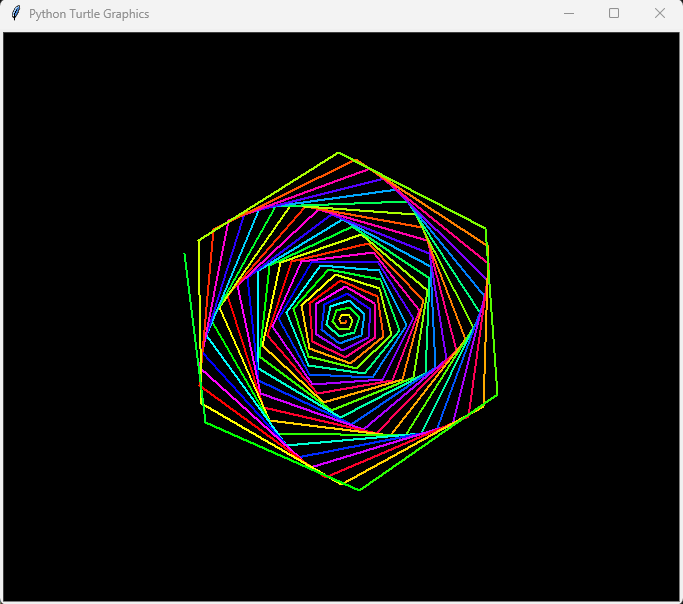
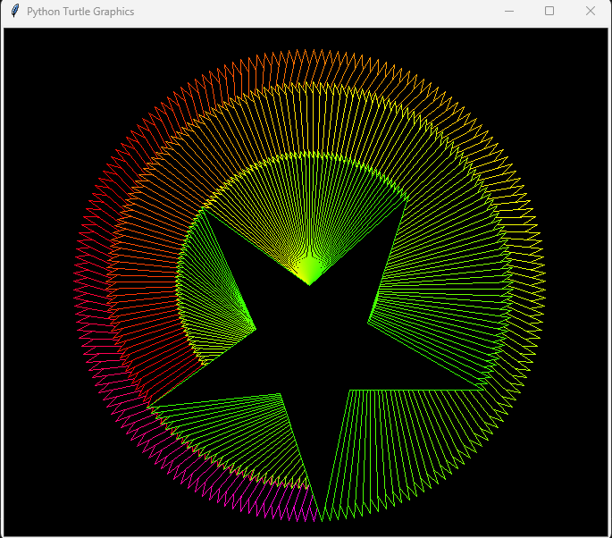

# TurtleArtPython 🐢🎨

Welcome to **TurtleArtPython**, an open collection of stunning Python Turtle Graphics artworks!

This repository hosts a variety of unique and captivating Turtle Art scripts with themes ranging from Void Galaxy,Explosion of beauty,Iphone and much more...

## 🎨 What’s inside TurtleArtPython?

- A growing collection of Turtle Graphics masterpieces  
- Diverse themes and visual styles  
- Easy-to-run and modifiable example scripts  
- A learning hub and creative playground for Python Turtle enthusiasts  

## 🖼️ Sample Turtle Art




…and many more to explore!


## 🚀 How to Run

Make sure you have Python 3 installed, then run any script with:

```bash
python filename.py
